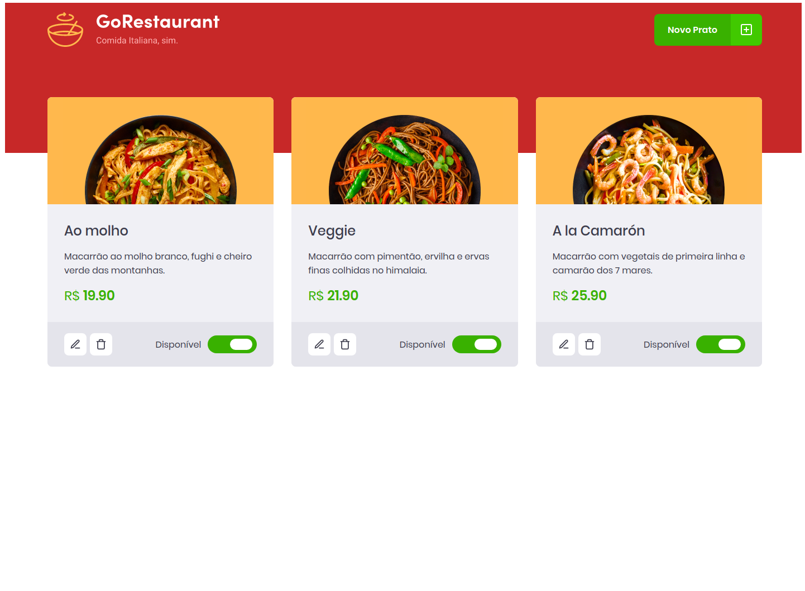

# GoRestaurant

## :rocket: Sobre

<p>O GoRestaurant é uma aplicação ficticia em <strong>React.js</strong> que se trata de um painel de adm para restaurantes
controlarem quais refeições estão disponíveis e quais estão indisponíveis.</p>

<p>Desenvolvida no <a href="https://github.com/Rocketseat/bootcamp-gostack-desafios/tree/master/desafio-reactjs-crud">desafio 10</a> do Bootcamp GoStack da Rocketseat.</p>

## Preview



## :books: Guia de instalação e execução

### Pré-requisitos

- [Git](https://git-scm.com/)
- [Node.js](https://nodejs.org/en/) v10.20 ou maior
- [Yarn](https://yarnpkg.com/)

### Como executar

- Clone este repositório ```git clone https://github.com/nathaliacristina20/gorestaurant.git```
- Vá até o diretório ```cd gorestaurant```
- Execute ```yarn``` para instalar as dependências
- Execute ```yarn start``` para rodar a aplicação
- Em outro terminal, execute ```yarn json-server server.json -p 3333``` para executar a simulação de uma API

Pronto! Você pode visualizar o GoRestaurant através do endereço http://localhost:3000

### Testes

- Para executar os testes rode ```yarn test```

## :page_with_curl: Licença

Esse projeto está sob a licença MIT. Veja o arquivo <a href="https://github.com/nathaliacristina20/gorestaurant/blob/master/LICENSE">LICENSE</a> para mais detalhes.

<hr />
<p>by Nathalia Cristina :wave: <a href="https://linktr.ee/nathaliacristina20">Get in touch!</a></p>
